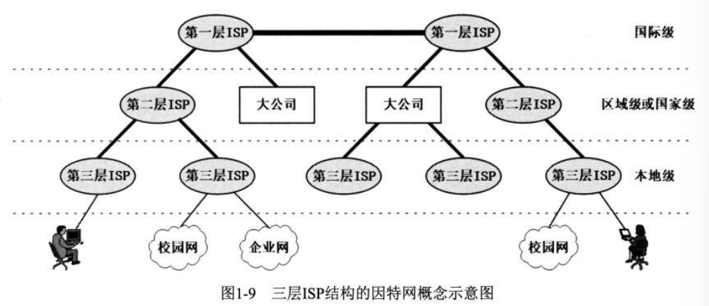
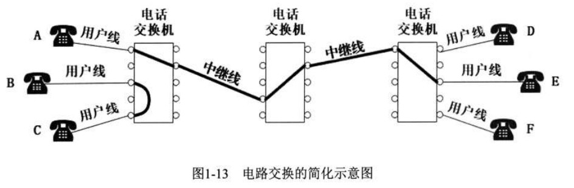

# Charter I	概述

## 1.2 因特网的发展历程------

### 1. ISP

Internet Service Provider：因特网服务提供者

### 2.三层ISP概念示意图

## 1.3 电路交换、分组交换、报文交换

### 1. 电路交换

早期专为电话通信服务的网络，需使用许多相互连接的电话交换机完成网络交换任务

电路交换通信步骤：

    1. 建立连接：主叫方拨号，被叫方听到摘机，建立起专门的物理通路

    2. 通话：基于已建立的连接进行通话，期间始终占用连接

    3. 释放连接：通话完毕挂机，交换机释放物理通路

### 2. 分组交换
